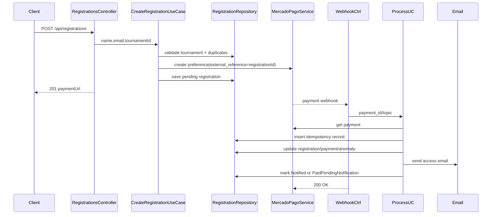

# Design: Mercado Pago Registration Flow

## Technical Approach

Extend the current registration slice instead of adding a parallel payment aggregate. `POST /api/registrations` will validate `tournament_id`, reuse only a fresh pending checkout for the same (`email`, `tournament_id`), block already-paid access for that tournament, and create a new immutable pending registration otherwise. Webhook processing will query Mercado Pago by `payment_id`, persist idempotency first, then reconcile registration, payment, anomaly, and notification state in one transaction. This follows the proposal and keeps Domain → Application → Infrastructure → Presentation boundaries already present in `Api/`.

## Architecture Decisions

| Decision | Options | Choice | Rationale |
|---|---|---|---|
| Registration lifecycle | Reuse current enum vs new payment aggregate | Expand `RegistrationStatus` and add payment/anomaly tables | The code already centers on `Registration`; keep checkout/webhook orchestration anchored there while storing audit details separately. |
| Duplicate policy | Update rejected rows vs immutable retries | New registration per retry after closed outcome | Matches prior decision for auditability and keeps `external_reference` tied to one checkout attempt. |
| Notification execution | Async queue now vs synchronous call with timeout | Synchronous Resend HTTP call with aggressive timeout | User scope requires immediate delivery attempt but durable fallback via `PaidPendingNotification`. |
| Webhook idempotency | Memory/cache vs DB unique key | PostgreSQL unique `payment_id` record | Survives restarts and handles duplicate webhook delivery safely. |

## Data Flow



Ordering for approved webhooks: (1) fetch MP payment, (2) begin transaction, (3) insert processed payment idempotency row, (4) lock registration by `external_reference`, (5) persist payment snapshot, (6) classify stale-link/mismatch/orphan, (7) update registration status, commit, (8) attempt Resend, (9) persist notification outcome. Duplicate `payment_id` short-circuits to 200.

Late approval vs stale-link: if the referenced registration belongs to a tournament that was active when the checkout was created (`TournamentClosedAt` is null or `registration.CreatedAt <= TournamentClosedAt`), honor approval and continue. If payment targets an old registration whose tournament was already closed before that checkout attempt, persist anomaly `StaleClosedTournamentPayment` and never auto-grant access.

## File Changes

| File | Action | Description |
|------|--------|-------------|
| `Api/Domain/Entities/Registration.cs` | Modify | Add `TournamentId`, payment timestamps, notification metadata, anomaly note hooks, state transition methods. |
| `Api/Domain/Entities/Tournament.cs` | Create | Active/closed tournament window and checkout eligibility source. |
| `Api/Domain/Entities/RegistrationPayment.cs` | Create | Store MP `payment_id`, status snapshot, amounts, payload refs. |
| `Api/Domain/Entities/WebhookDelivery.cs` | Create | Persist idempotency key and processing timestamps. |
| `Api/Domain/Entities/RegistrationAnomaly.cs` | Create | Manual-review evidence for orphan, mismatch, stale-link cases. |
| `Api/Domain/Enums/RegistrationStatus.cs` | Modify | Use `Pending`, `Paid`, `PaidPendingNotification`, `Notified`, `Rejected`, `Expired`, `ManualReview`. |
| `Api/Application/UseCases/Registrations/CreateRegistrationUseCase.cs` | Modify | Tournament validation, scoped duplicate rules, immutable retry behavior. |
| `Api/Application/UseCases/Webhooks/ProcessMercadoPagoWebhookUseCase.cs` | Create | Payment lookup, reconciliation, idempotency, notification orchestration. |
| `Api/Application/Abstractions/*` | Modify/Create | Add tournament lookup, webhook/idempotency, payment query, notification interfaces. |
| `Api/Infrastructure/Persistence/AppDbContext.cs` | Modify | Map new tables, indexes, unique constraints, row version if used. |
| `Api/Infrastructure/Persistence/Repositories/*.cs` | Modify/Create | Transactional queries, registration locking, payment/anomaly persistence. |
| `Api/Infrastructure/Payments/MercadoPagoService.cs` | Modify | Official SDK preference creation + payment retrieval mapping. |
| `Api/Infrastructure/Notifications/ResendEmailService.cs` | Create | Raw HTTP client with aggressive timeout and typed options. |
| `Api/Presentation/Controllers/RegistrationsController.cs` | Modify | Accept `tournament_id`; translate business errors. |
| `Api/Presentation/Controllers/MercadoPagoWebhookController.cs` | Create | Minimal 200-ack endpoint. |

## Interfaces / Contracts

```csharp
public sealed record CreateRegistrationCommand(string Name, string Email, Guid TournamentId);
public sealed record ProcessMercadoPagoWebhookCommand(string Topic, string PaymentId);
```

Checkout request adds `tournamentId`. Webhook controller only parses route/query/body metadata, delegates to the use case, and always returns `200 OK` after durable processing/classification. Checkout returns `registrationId`, `paymentUrl`, `isExisting`.

## Testing Strategy

| Layer | What to Test | Approach |
|-------|-------------|----------|
| Unit | Status transitions, late-approval vs stale-link classification, duplicate rules | Pure domain/application tests with mocks. |
| Integration | PostgreSQL constraints, transactional idempotency ordering, repository locking | Add real Postgres-backed tests; avoid relying only on EF InMemory. |
| HTTP | Controller contracts and 200 webhook ack behavior | WebApplicationFactory-style tests. |
| External adapters | MP/Resend request mapping and timeout handling | Mock `HttpMessageHandler` / SDK seams. |

Current risk: `tests/Api.Tests/Api.Tests.csproj` uses EF Core InMemory `10.0.0-preview.3` while app packages are `10.0.x`; fix that mismatch before trusting automated tests.

## Migration / Rollout

Add EF Core migrations for new tables/indexes, deploy config for Mercado Pago and Resend, and enable the webhook endpoint only once credentials and callback URL are live. No data migration required.

## Open Questions

- [ ] Confirm whether tournament price/currency lives on `Tournament` or separate pricing config.
- [ ] Confirm the exact access-link payload/content required for Resend templates.
